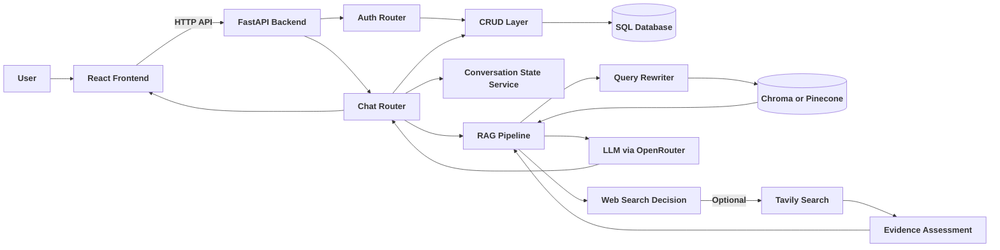
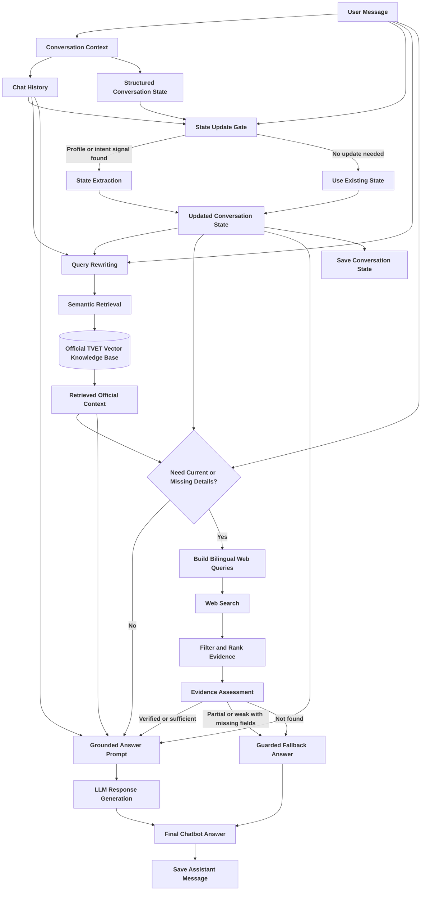
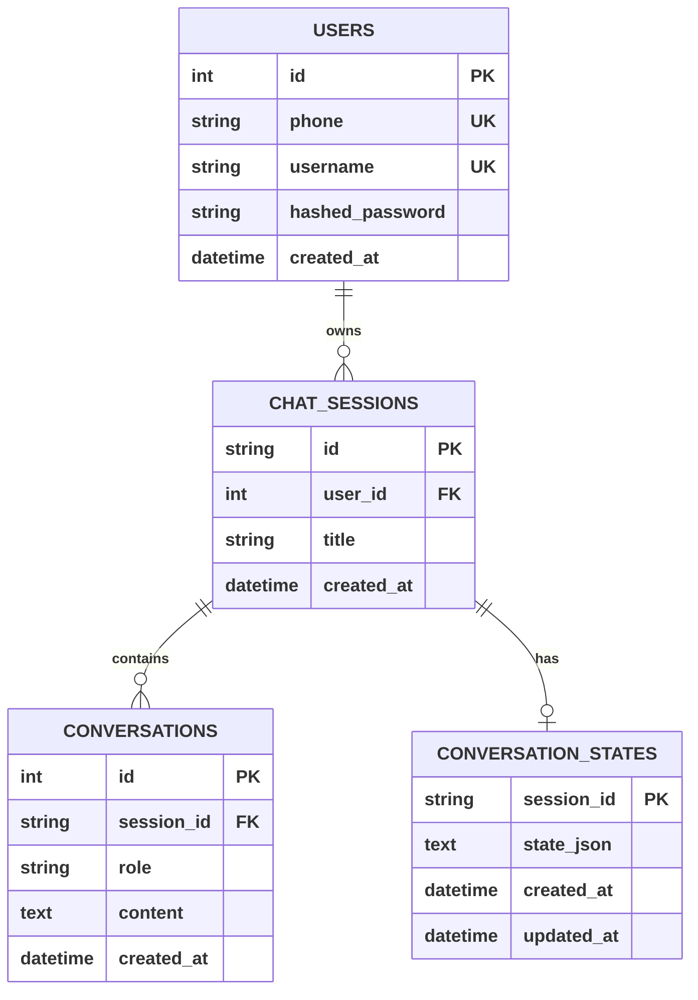
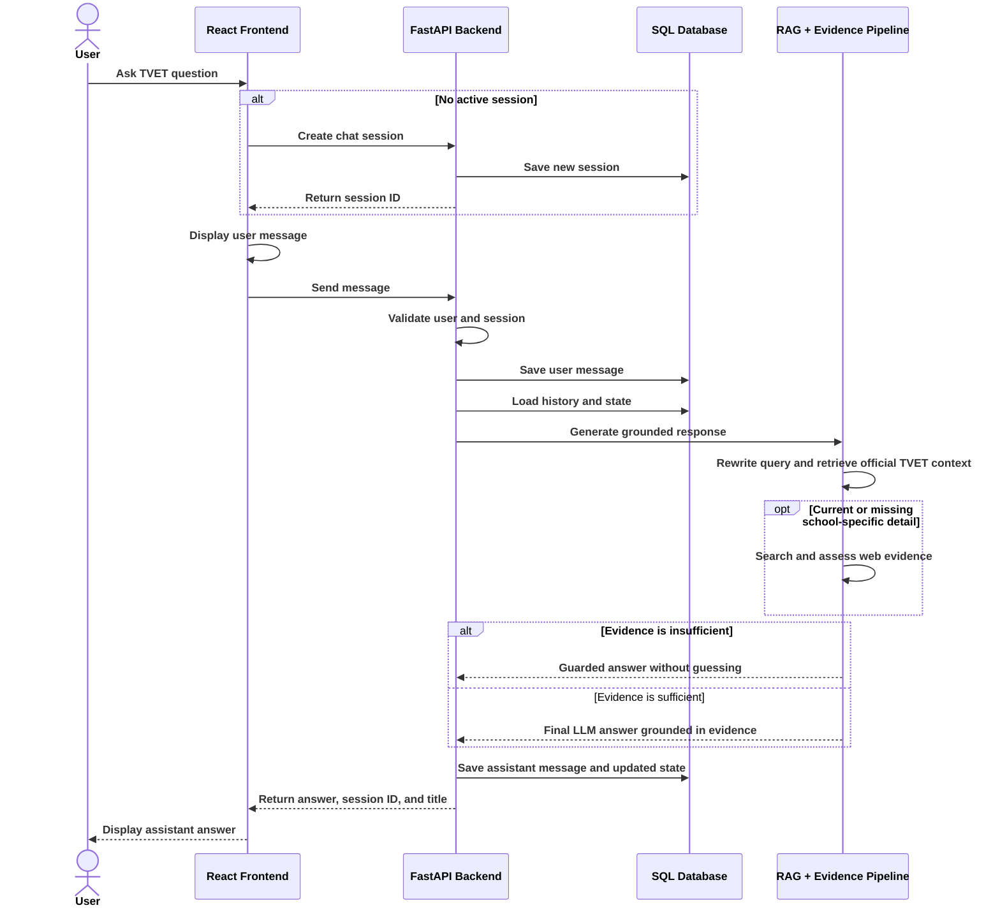
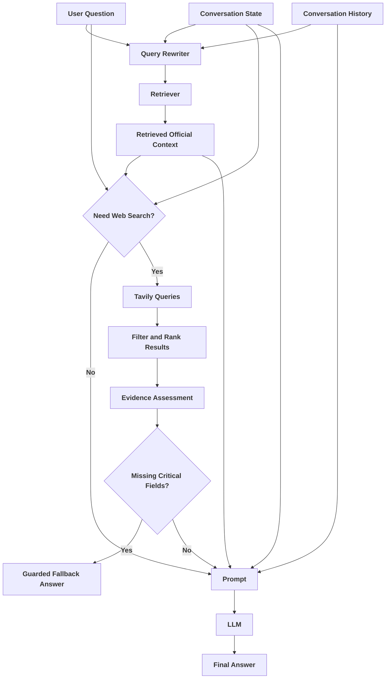
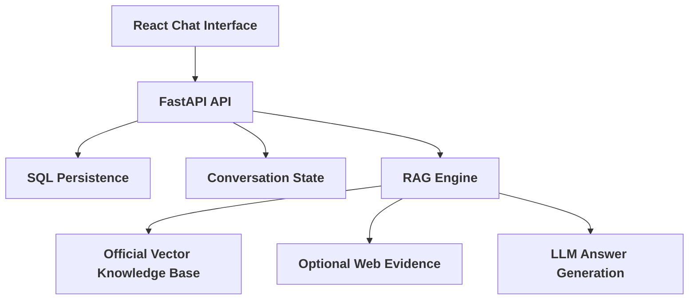

# TVET Chatbot Project Documentation

Last updated: 2026-05-29

This document explains the current TVET Chatbot system from end to end. It covers the project purpose, system architecture, authentication, database design, chat flow, Retrieval-Augmented Generation (RAG), conversation state, web evidence handling, ingestion workflow, and frontend behavior.

## 1. Project Overview

The TVET Chatbot is a full-stack conversational AI system designed to support access to Technical and Vocational Education and Training (TVET) information in Cambodia.

The primary target user is a school counselor helping Grade 9 students who may be at risk of dropping out. The system can also support students and parents who need understandable information about TVET schools, programs, admission requirements, scholarships, fees, and institute contacts.

The chatbot is intentionally bounded. It is not designed to be a full career advisor, therapist, financial advisor, or job-outcome guarantor. Its role is to provide grounded TVET information and basic program-selection support using trusted evidence.

At a high level:

- The frontend is a React/Vite chat interface.
- The backend is a FastAPI API server.
- Users register and log in with phone number and password.
- The backend stores users, chat sessions, messages, and structured conversation state in a SQL database.
- The RAG pipeline retrieves TVET information from a vector database.
- The system can optionally use Tavily web search for current or school-specific information that may be missing from the official document.
- The final answer is generated by an LLM through OpenRouter, constrained by retrieved evidence and prompt guardrails.

## 2. Current Technology Stack

| Layer | Technology | Purpose |
| --- | --- | --- |
| Frontend | React + Vite | Chat UI, authentication screens, session sidebar, message rendering |
| Backend | FastAPI | HTTP API for auth, sessions, chat, and RAG invocation |
| Database ORM | SQLAlchemy | Database models and CRUD operations |
| Authentication | bcrypt + JWT | Password hashing and bearer-token authentication |
| RAG framework | LangChain components | Embeddings, vector stores, prompts, LLM client, output parsing |
| Embedding model | `intfloat/multilingual-e5-large` | Multilingual semantic representation for Khmer and English text |
| Vector storage | Chroma or Pinecone | Stores and retrieves embedded TVET document chunks |
| LLM access | OpenRouter-compatible OpenAI client | Calls `google/gemini-2.0-flash-lite-001` |
| Web evidence | Tavily API | Optional current-information search layer |

## 3. Folder Structure

```text
tvet-chatbot/
|-- backend/
|   |-- main.py
|   |-- database.py
|   |-- crud.py
|   |-- migrate_to_pinecone.py
|   |-- requirements.txt
|   |-- core/
|   |   `-- config.py
|   |-- routers/
|   |   |-- auth.py
|   |   `-- chat.py
|   |-- scripts/
|   |   `-- ingest_pdf.py
|   `-- services/
|       |-- auth_service.py
|       |-- deps.py
|       |-- embedding_service.py
|       |-- ingest_service.py
|       |-- rag_service.py
|       |-- state_service.py
|       |-- title_service.py
|       `-- web_search_service.py
|
|-- frontend/
|   |-- package.json
|   |-- vite.config.js
|   |-- src/
|   |   |-- App.jsx
|   |   |-- constants/
|   |   |   `-- index.js
|   |   |-- hooks/
|   |   |   |-- useAuth.js
|   |   |   `-- useChat.js
|   |   |-- components/
|   |   |   |-- AuthScreen.jsx
|   |   |   |-- Sidebar.jsx
|   |   |   |-- Message.jsx
|   |   |   |-- ChatInput.jsx
|   |   |   |-- SuggestedQuestions.jsx
|   |   |   `-- TypingDots.jsx
|   |   `-- styles/
|   |       `-- global.css
|
|-- chroma_db/
|-- .env
|-- README.md
|-- PROJECT_HANDOFF.md
|-- RAG_INGESTION_WORKFLOW.md
|-- PROJECT_DOCUMENTATION.md
|-- TVET BOOK 2023 Final.pdf
`-- docker-compose.yml
```

## 4. System Architecture



The frontend never calls the database, vector store, Tavily, or OpenRouter directly. All secure operations happen through the backend.

## 4.1 Chatbot Architecture

The following diagram focuses only on the chatbot intelligence layer. It shows how a user message is transformed into a grounded answer through memory, retrieval, evidence assessment, and response generation.

This is a conceptual workflow graph. The current implementation uses a custom `RagPipeline` object rather than LangGraph, but the diagram represents the chatbot's internal reasoning flow in a graph-like way.



Main chatbot layers:

- **Memory layer:** Uses chat history and structured conversation state.
- **Retrieval layer:** Rewrites the query and retrieves official TVET document chunks.
- **Evidence layer:** Optionally searches the web and evaluates whether evidence is strong enough.
- **Guardrail layer:** Prevents guessing when important information is missing.
- **Generation layer:** Produces the final answer using the LLM only after evidence is prepared.

## 5. Backend Entry Point

The backend starts from `backend/main.py`.

Main responsibilities:

- Creates the FastAPI application.
- Enables CORS for the local frontend at `http://localhost:5173`.
- Registers the authentication router.
- Registers the chat router.
- Initializes database tables through `init_db()`.
- Provides a root health endpoint at `/`.

Root endpoint:

```text
GET /
```

Response:

```json
{
  "message": "TVET Chatbot API is running"
}
```

## 6. Configuration

Configuration is centralized in `backend/core/config.py` and loaded from the root `.env` file through `pydantic-settings`.

Important settings:

| Setting | Purpose |
| --- | --- |
| `OPENROUTER_API_KEY` | API key for the OpenRouter LLM call |
| `DATABASE_URL` | SQLAlchemy database connection string |
| `SECRET_KEY` | Secret key used to sign JWT tokens |
| `ALGORITHM` | JWT signing algorithm, default `HS256` |
| `ACCESS_TOKEN_EXPIRE_MINUTES` | Token lifetime, default 7 days |
| `CHROMA_DIR` | Local Chroma persistence directory |
| `VECTOR_STORE_PROVIDER` | Selects `chroma` or `pinecone` |
| `VECTOR_COLLECTION_NAME` | Chroma collection name or logical vector collection name |
| `PINECONE_API_KEY` | Required when using Pinecone |
| `PINECONE_INDEX` | Pinecone index name |
| `PINECONE_NAMESPACE` | Optional Pinecone namespace |
| `EMBEDDING_USE_E5_PREFIXES` | Enables E5 `query:` and `passage:` prefixes |
| `EMBEDDING_NORMALIZE` | Enables embedding normalization |
| `RETRIEVER_K` | Number of document chunks retrieved |
| `ENABLE_WEB_SEARCH` | Enables or disables Tavily web evidence |
| `TAVILY_API_KEY` | Required when web search is enabled |
| `TAVILY_MAX_RESULTS` | Maximum Tavily results per search |
| `TAVILY_SEARCH_DEPTH` | Tavily search depth |
| `TAVILY_TIMEOUT_SECONDS` | Tavily request timeout |

Secrets should remain in `.env` and should not be committed to source control.

## 7. Database Design

The database models are defined in `backend/database.py`.

Current tables:

- `users`
- `chat_sessions`
- `conversations`
- `conversation_states`



### Table Purposes

- `users` stores registered accounts. Passwords are stored as bcrypt hashes.
- `chat_sessions` stores separate conversations for each user.
- `conversations` stores individual user and assistant messages.
- `conversation_states` stores structured session-level state as JSON text.

## 8. CRUD Layer

Database helper functions live in `backend/crud.py`.

Main responsibilities:

- Create and retrieve users.
- Create, list, rename, and delete chat sessions.
- Save and load conversation messages.
- Verify session ownership by checking both `session_id` and `user_id`.
- Get or upsert structured conversation state.

Session deletion also deletes related messages and conversation state before deleting the session row.

## 9. Authentication Flow

Authentication is implemented across:

- `backend/routers/auth.py`
- `backend/services/auth_service.py`
- `backend/services/deps.py`
- `frontend/src/hooks/useAuth.js`
- `frontend/src/components/AuthScreen.jsx`

### Registration

Endpoint:

```text
POST /auth/register
```

Request:

```json
{
  "phone": "string",
  "username": "string",
  "password": "string"
}
```

Behavior:

- Checks whether the phone number is already registered.
- Hashes the password with bcrypt.
- Creates a new user record.
- Returns the new user ID and username.

### Login

Endpoint:

```text
POST /auth/login
```

Request:

```json
{
  "phone": "string",
  "password": "string"
}
```

Behavior:

- Finds the user by phone number.
- Verifies the password against the stored bcrypt hash.
- Creates a JWT token with the user ID in the `sub` claim.
- Returns the token, username, and user ID.

Protected requests use:

```text
Authorization: Bearer <access_token>
```

The frontend currently stores the token only in React state, so login is lost after a page refresh.

## 10. Chat API

Chat endpoints are defined in `backend/routers/chat.py`.

| Method | Endpoint | Purpose | Auth Required |
| --- | --- | --- | --- |
| `POST` | `/chat/session` | Create a new chat session | Yes |
| `GET` | `/chat/sessions` | List current user's sessions | Yes |
| `GET` | `/chat/session/{session_id}` | Load messages for a session | Yes |
| `DELETE` | `/chat/session/{session_id}` | Delete a session and its stored data | Yes |
| `POST` | `/chat/no-stream` | Send a message and receive a full response | Yes |

The active chat endpoint is non-streaming:

```text
POST /chat/no-stream
```

Request:

```json
{
  "session_id": "optional-session-id",
  "message": "user question"
}
```

Response:

```json
{
  "response": "assistant answer",
  "session_id": "session-id",
  "title": "session title"
}
```

If no `session_id` is provided, the backend creates a new session. The frontend usually creates a session before sending the first chat message, but the backend also supports direct chat calls without an existing session.

## 11. Runtime Chat Flow

The current backend chat flow is:

```text
user message
-> verify JWT and current user
-> create or verify chat session
-> save user message
-> generate session title from first message if needed
-> load previous chat history
-> load stored conversation state
-> decide whether state extraction is needed
-> update state with LLM extractor when needed
-> invoke RAG pipeline
   -> rewrite retrieval query using history and state
   -> retrieve official TVET chunks from vector store
   -> decide whether web search is needed
   -> optionally build English and Khmer Tavily queries
   -> optionally retrieve, filter, rank, and assess web evidence
   -> generate answer or return guarded deterministic fallback
-> save assistant message
-> save updated conversation state
-> return answer, session ID, and title
```

This flow is more agentic than a simple prompt-response chatbot because it performs several intermediate decisions and evidence-processing steps before generating the final answer.

### Compact Swimlane Diagram

The following compact swimlane-style sequence diagram shows the main user message flow without every internal implementation detail.



## 12. RAG Pipeline

RAG logic is implemented in `backend/services/rag_service.py`.

The router imports:

```python
chain = build_chain()
```

Although it is named `chain`, the current object is a custom `RagPipeline`, not a simple LCEL chain.

### Main RAG Components

- `load_vectorstore()` loads either Chroma or Pinecone based on configuration.
- `get_embeddings()` loads multilingual E5 embeddings.
- `rewrite_retrieval_query()` converts the latest user message into a standalone retrieval query.
- The retriever returns the top `RETRIEVER_K` relevant chunks.
- `build_web_context()` optionally triggers web search and formats evidence.
- The answer chain combines the system prompt, history, state, retrieved context, web evidence, and user question.

### RAG Flow



## 13. Prompt Behavior

The system prompt defines the chatbot as a TVET advisor for Cambodia.

Important behavior rules:

- Match the user's language: Khmer, English, or mixed.
- Answer the user's direct question first.
- Ask at most one follow-up question, only when useful.
- Do not repeatedly greet the user once history exists.
- Do not end with generic repeated prompts.
- Do not ask for profile details unless needed for matching or recommendation.
- Respect refusal to share personal details.
- Use retrieved context and assessed web evidence only.
- Clearly distinguish official TVET database facts from web evidence.
- Do not invent program details, costs, schedules, scholarships, or outcomes.
- Do not guarantee employment.
- Do not act as a full career advisor or predict the job market.
- Include institute contact details when available and relevant.

These prompt boundaries are part of the hallucination-mitigation strategy.

## 14. Conversation State

Conversation state is handled in `backend/services/state_service.py` and stored in the `conversation_states` table.

The default state shape is:

```json
{
  "user_profile": {
    "user_type": null,
    "student_grade": null,
    "student_age": null,
    "province": null,
    "district": null,
    "interests": [],
    "student_uncertain": null,
    "financial_constraint": null,
    "can_relocate": null,
    "preferred_work_style": null,
    "urgency_to_earn_income": null,
    "desired_career": null
  },
  "conversation": {
    "language": null,
    "intent": null,
    "needs_recommendation": false,
    "needs_application_info": false,
    "needs_scholarship_info": false,
    "user_refused_profile": false
  }
}
```

### State Extraction

State extraction uses an LLM with a strict JSON output prompt. The extracted state is sanitized before storage.

To reduce unnecessary LLM calls, extraction is gated:

- It runs for new sessions.
- It runs when the latest message contains profile, intent, location, scholarship, cost, or recommendation-related signals.
- It skips obvious short follow-ups such as `more`, `why`, `yes`, `no`, or similar Khmer equivalents.

The state helps the chatbot answer follow-up questions, personalize program guidance, and avoid repeatedly asking for information already provided.

## 15. Query Rewriting

The query rewriter converts the latest user message into a standalone semantic search query.

This is useful for follow-up questions such as:

```text
What about the fee?
```

With history and state, the system can rewrite this into a more complete retrieval query related to the previously discussed institute, program, province, or requirement.

The rewritten query is used only for retrieval. It is not shown to the user and does not directly answer the question.

## 16. Vector Store And Embeddings

Embedding configuration is centralized in `backend/services/embedding_service.py`.

Current embedding model:

```text
intfloat/multilingual-e5-large
```

The project supports E5-style prefixes:

```text
passage: <document chunk>
query: <user question>
```

These prefixes help the embedding model distinguish between stored passages and search queries. They are applied during embedding and query embedding, not displayed to the user.

The runtime vector store is selected by:

```env
VECTOR_STORE_PROVIDER=chroma
```

or:

```env
VECTOR_STORE_PROVIDER=pinecone
```

Supported vector stores:

- Chroma for local persisted vector storage.
- Pinecone for hosted vector storage.

Ingestion and runtime retrieval should use the same embedding settings, especially E5 prefixes and normalization.

## 17. PDF Ingestion Workflow

The ingestion workflow is admin-only and separate from the public chat API.

Main files:

- `backend/services/embedding_service.py`
- `backend/services/ingest_service.py`
- `backend/scripts/ingest_pdf.py`
- `RAG_INGESTION_WORKFLOW.md`

Ingestion flow:

```text
official PDF
-> extract text with PyMuPDF
-> normalize and clean text
-> remove probable page numbers
-> split into Khmer-aware chunks
-> create metadata and chunk IDs
-> embed chunks with multilingual E5
-> write to Chroma or Pinecone
```

Default chunking:

```text
chunk_size: 1000 characters
chunk_overlap: 150 characters
```

Stored metadata includes:

- source filename
- source path
- document version
- page number
- start index
- chunk index
- stable chunk ID

Dry run example:

```powershell
cd backend
python scripts\ingest_pdf.py --pdf "..\TVET BOOK 2023 Final.pdf" --store chroma --collection tvet_programs_v2 --version 2026 --dry-run
```

Ingest example:

```powershell
cd backend
python scripts\ingest_pdf.py --pdf "..\TVET BOOK 2023 Final.pdf" --store chroma --collection tvet_programs_v2 --version 2026 --reset
```

## 18. Tavily Web Evidence Layer

The Tavily web search layer is optional and controlled by `.env`.

It is used only for missing, current, or school-specific information such as:

- duration
- schedule
- enrollment or intake
- deadline
- scholarship
- tuition or fees
- recent announcements or events

It is not used for labor-market prediction or job guarantees.

### Web Evidence Flow

Implemented in `backend/services/web_search_service.py`:

```text
should_search_web()
-> build_bilingual_queries()
-> run_tavily_searches()
-> dedupe_and_rank_results()
-> evaluate_web_evidence()
-> format_web_context_for_prompt()
```

The service builds English and Khmer search queries, filters irrelevant results, classifies source type, detects supported fields, and assesses whether the evidence is strong enough to answer.

Evidence modes:

- `verified_answer`
- `partial_answer`
- `weak_signal_answer`
- `not_found_contact_school`

If important requested fields are missing from weak or partial evidence, the pipeline may return a deterministic guarded answer instead of allowing the LLM to fill the gaps.

This is intentional. It prevents the chatbot from presenting uncertain web results as confirmed facts.

## 19. Guarded Answers

Guarded answers are generated when the system cannot fully verify requested fields such as duration, schedule, tuition, enrollment, or scholarship.

Instead of guessing, the chatbot explains that the details could not be verified and recommends contacting the institute directly.

Example behavior:

```text
I could not fully verify these details from the official TVET database or the web evidence.

Not verified: duration, schedule.

I found related evidence that this institute has had scholarship/support information before, but I cannot confirm that it is currently open.

Source: <source URL>

For the safest answer, contact the institute directly to confirm.
```

This mechanism is one of the main reliability features of the project.

## 20. Frontend Structure

The frontend is a React/Vite application.

Main files:

| File | Purpose |
| --- | --- |
| `frontend/src/App.jsx` | Main app layout and screen switching |
| `frontend/src/hooks/useAuth.js` | Login, register, logout, auth state |
| `frontend/src/hooks/useChat.js` | Session loading, switching, deleting, message sending |
| `frontend/src/constants/index.js` | API URLs and suggested starter questions |
| `frontend/src/components/AuthScreen.jsx` | Login/register UI |
| `frontend/src/components/Sidebar.jsx` | Session list, new session, delete session, logout |
| `frontend/src/components/Message.jsx` | Markdown-aware message rendering |
| `frontend/src/components/ChatInput.jsx` | Textarea, send button, suggestion chips |
| `frontend/src/components/SuggestedQuestions.jsx` | Empty-state starter prompts |
| `frontend/src/components/TypingDots.jsx` | Loading indicator |
| `frontend/src/styles/global.css` | Main responsive visual design |

## 21. Frontend Behavior

The frontend flow:

```text
app starts
-> if no token, show auth screen
-> user logs in or registers
-> show chat workspace
-> load user's chat sessions
-> user creates/selects a session or sends first message
-> show user message immediately
-> call backend /chat/no-stream
-> show typing indicator
-> render assistant answer as Markdown
-> update session title if backend returns a new title
```

Current UI features:

- Login/register screen.
- In-memory auth state.
- Chat workspace.
- Session sidebar.
- Create new session.
- Switch session.
- Delete session.
- User logout.
- Suggested starter questions.
- Markdown rendering for assistant answers.
- Dark/light theme toggle saved in browser local storage.
- Responsive layout for desktop and mobile.

## 22. Session Titles

New sessions initially use:

```text
New Conversation
```

When the user sends the first message, the backend creates a short title using `backend/services/title_service.py`.

The title is based on the first user message and trimmed to a maximum length. The frontend updates the sidebar when the backend returns the generated title.

## 23. API Summary

### Health Check

```text
GET /
```

### Register

```text
POST /auth/register
```

### Login

```text
POST /auth/login
```

### Create Chat Session

```text
POST /chat/session
Authorization: Bearer <token>
```

### List Chat Sessions

```text
GET /chat/sessions
Authorization: Bearer <token>
```

### Get Session Messages

```text
GET /chat/session/{session_id}
Authorization: Bearer <token>
```

### Delete Session

```text
DELETE /chat/session/{session_id}
Authorization: Bearer <token>
```

### Send Chat Message

```text
POST /chat/no-stream
Authorization: Bearer <token>
Content-Type: application/json
```

Body:

```json
{
  "session_id": "optional-session-id",
  "message": "question"
}
```

## 24. Security And Privacy Model

Security controls:

- Passwords are hashed with bcrypt.
- Login returns a signed JWT token.
- Chat endpoints require bearer-token authentication.
- The backend validates the token and loads the current user.
- Session access is checked against the authenticated user ID.
- Users cannot load or delete another user's sessions through normal API access.

Privacy boundaries:

- The system should not ask for or store unnecessary sensitive student identity data.
- It should not request full names, ID numbers, or other highly sensitive identifiers.
- Conversation state stores only advising-relevant attributes such as location, grade, interests, and constraints.

Current limitation:

- The frontend token is stored only in memory, so users must log in again after refreshing the page.

## 25. Known Limitations

- The official PDF may not contain complete duration, schedule, fee, enrollment, or scholarship details.
- PDF extraction and chunking quality directly affect retrieval quality.
- Some retrieved chunks may be thin or table-of-contents-like depending on source document structure.
- Tavily search results can be irrelevant, outdated, or too generic; filtering and evidence assessment reduce but do not eliminate this issue.
- Social media results are treated as weak evidence unless clearly official and directly relevant.
- The system does not perform reliable labor-market analysis.
- The system should not promise employment outcomes.
- The frontend uses non-streaming responses, even though older streaming code remains commented in the backend.
- `docker-compose.yml` exists but is currently empty.

## 26. Recommended Evaluation

Evaluate the chatbot using realistic counselor, parent, and student conversations in both Khmer and English.

Suggested scenarios:

- General TVET program search by province.
- Admission/application requirements.
- Scholarship or financial-support questions.
- School-specific duration, schedule, tuition, or enrollment questions.
- Follow-up questions that depend on chat history.
- Student uncertainty about which skill to choose.
- Requests for job guarantees or career prediction.
- Missing-information cases where the chatbot should refuse to guess.

For each test, check:

- Did retrieval return relevant official chunks?
- Did query rewriting improve follow-up retrieval?
- Did the answer use retrieved evidence instead of unsupported knowledge?
- Did the chatbot avoid hallucinating fees, schedules, or scholarships?
- Did it ask at most one useful follow-up question?
- Did it avoid repeated greetings?
- Did it respect the career/job-outcome boundary?
- Did web evidence appear only when relevant and enabled?

## 27. How To Run Locally

### Backend

PowerShell:

```powershell
cd backend
.\venv\Scripts\Activate.ps1
uvicorn main:app --reload
```

Backend URL:

```text
http://localhost:8000
```

### Frontend

PowerShell:

```powershell
cd frontend
npm run dev
```

Frontend URL:

```text
http://localhost:5173
```

Restart the backend after changing `.env`, because the RAG pipeline is built when the chat router imports `build_chain()`.

## 28. Mental Model

The system can be understood as five connected layers:



The SQL database remembers users, sessions, messages, and structured advising context. The vector database stores embedded TVET knowledge from official documents. The web evidence layer cautiously supplements missing current information. The LLM generates the final response, but only after the system retrieves and prepares evidence.

In short, the project is a grounded, evidence-aware TVET advising chatbot rather than an unconstrained general chatbot.
