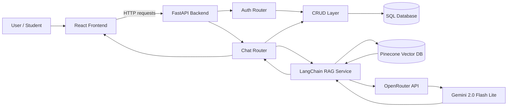
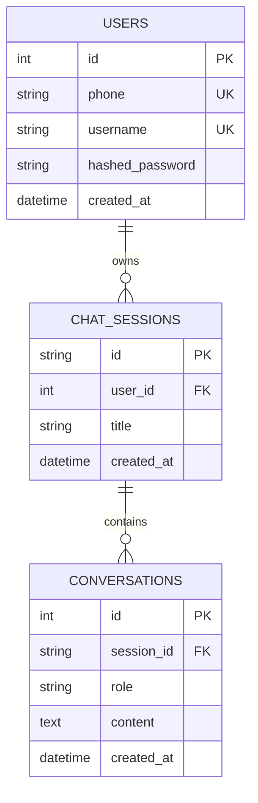
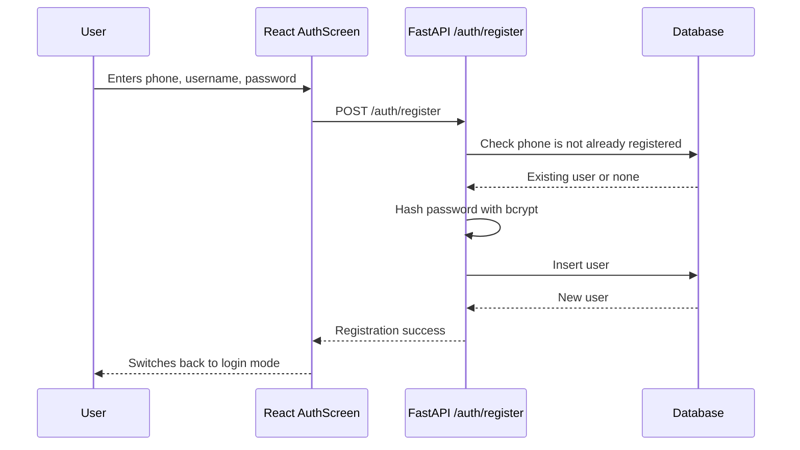
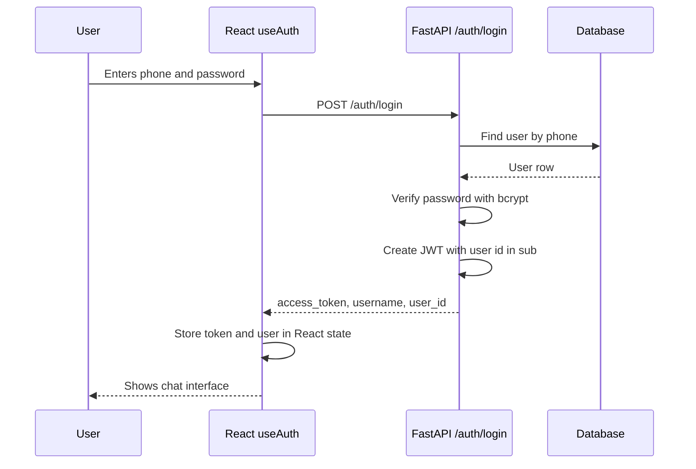
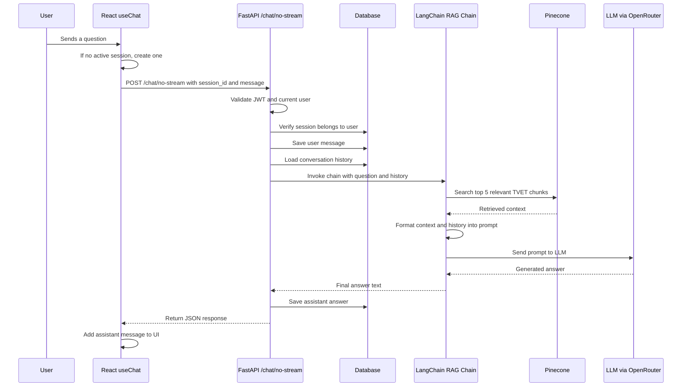
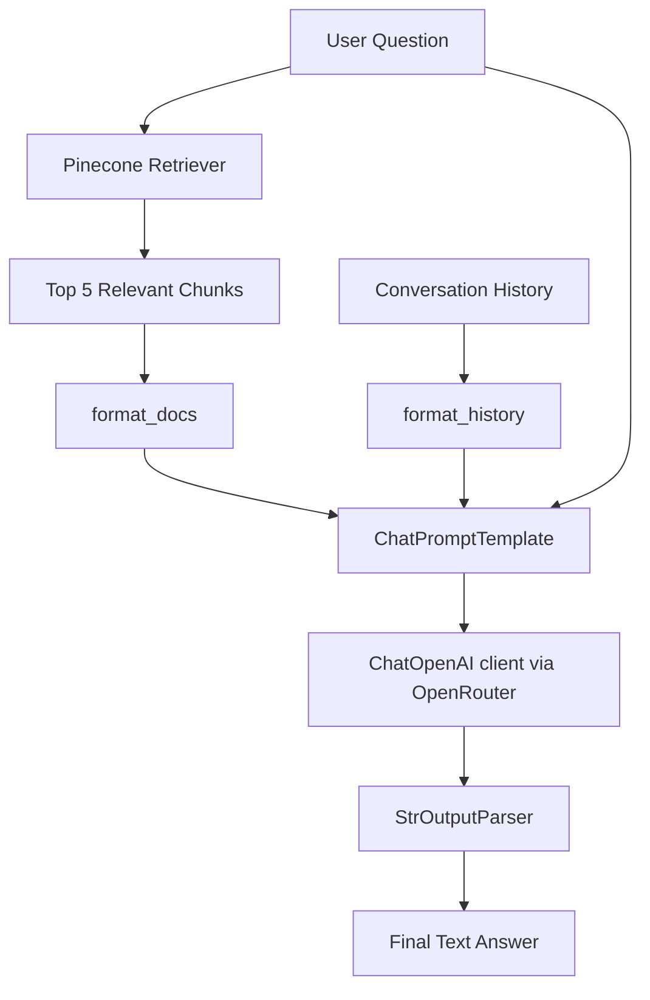
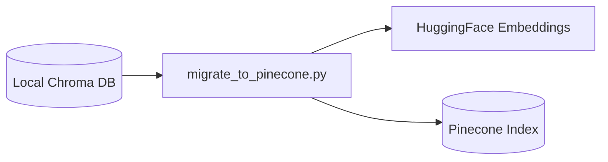
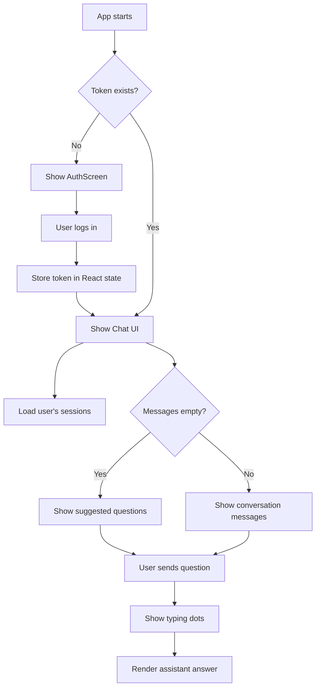
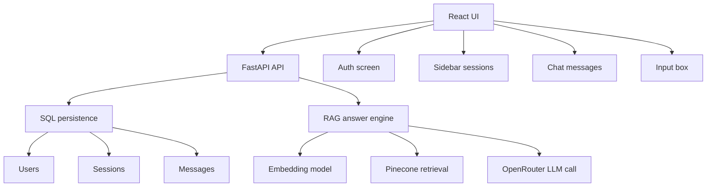

# TVET Chatbot Project Documentation

This document explains how the TVET Chatbot project works from end to end. It covers the frontend, backend, database, authentication, chat session handling, Retrieval-Augmented Generation (RAG), and the main logic flows.

## 1. Project Overview

The project is a full-stack chatbot application for helping students ask questions about TVET programs in Cambodia.

At a high level:

- The frontend is a React/Vite chat interface.
- The backend is a FastAPI API server.
- Users register and log in with phone number and password.
- The backend stores users, chat sessions, and messages in a SQL database through SQLAlchemy.
- Chat answers are generated by a LangChain RAG chain.
- The RAG chain retrieves relevant TVET data from Pinecone, sends the retrieved context plus the user's question to an LLM through OpenRouter, and returns the final answer.

## 2. Main Technology Stack

| Layer | Technology | Purpose |
| --- | --- | --- |
| Frontend | React | Builds the chat UI and authentication screens |
| Frontend tooling | Vite | Runs and builds the frontend app |
| Backend | FastAPI | Exposes HTTP API endpoints |
| Database ORM | SQLAlchemy | Defines database models and performs queries |
| Authentication | JWT + bcrypt | Password hashing and bearer-token authentication |
| RAG orchestration | LangChain | Builds the retrieval and LLM answer pipeline |
| Vector database | Pinecone | Stores and searches embedded TVET document chunks |
| Embeddings | `intfloat/multilingual-e5-large` | Converts text into vectors for semantic search |
| LLM provider | OpenRouter-compatible OpenAI client | Calls `google/gemini-2.0-flash-lite-001` |

## 3. Folder Structure

```text
tvet-chatbot/
|-- backend/
|   |-- main.py
|   |-- database.py
|   |-- crud.py
|   |-- migrate_to_pinecone.py
|   |-- requirements.txt
|   |-- core/
|   |   `-- config.py
|   |-- routers/
|   |   |-- auth.py
|   |   `-- chat.py
|   `-- services/
|       |-- auth_service.py
|       |-- deps.py
|       `-- rag_service.py
|
|-- frontend/
|   |-- package.json
|   |-- vite.config.js
|   |-- src/
|   |   |-- App.jsx
|   |   |-- constants/
|   |   |   `-- index.js
|   |   |-- hooks/
|   |   |   |-- useAuth.js
|   |   |   `-- useChat.js
|   |   |-- components/
|   |   |   |-- AuthScreen.jsx
|   |   |   |-- Sidebar.jsx
|   |   |   |-- Message.jsx
|   |   |   |-- ChatInput.jsx
|   |   |   |-- SuggestedQuestions.jsx
|   |   |   `-- TypingDots.jsx
|   |   `-- styles/
|   |       `-- global.css
|
|-- chroma_db/
|-- .env
|-- README.md
`-- docker-compose.yml
```

## 4. System Architecture



The frontend never talks directly to the database, Pinecone, or OpenRouter. It only sends HTTP requests to the FastAPI backend. The backend is responsible for authentication, database access, RAG retrieval, and LLM calls.

## 5. Backend Entry Point

The backend starts from `backend/main.py`.

Main responsibilities:

- Creates the FastAPI app.
- Enables CORS for `http://localhost:5173`, which is the Vite frontend dev server.
- Registers the auth router.
- Registers the chat router.
- Calls `init_db()` to create database tables if they do not already exist.
- Exposes a root health endpoint at `/`.

Important logic:

```python
app.include_router(auth_router)
app.include_router(chat_router)
init_db()
```

This means the auth and chat endpoints become active when the backend starts, and the database schema is initialized automatically.

## 6. Configuration

Configuration is handled in `backend/core/config.py`.

The project uses `pydantic-settings` to load environment variables from the root `.env` file.

Required settings:

| Setting | Purpose |
| --- | --- |
| `openrouter_api_key` | API key used to call the LLM through OpenRouter |
| `database_url` | SQLAlchemy database connection URL |
| `pinecone_api_key` | API key for Pinecone |
| `pinecone_index` | Pinecone index name |
| `secret_key` | Secret used to sign JWT tokens |
| `algorithm` | JWT signing algorithm, default `HS256` |
| `access_token_expire_minutes` | Token lifetime, default 7 days |
| `chroma_dir` | Local Chroma DB path, currently mainly used by migration code |

Do not hard-code secrets in source files. Keep them in `.env`.

## 7. Database Design

The SQLAlchemy models are defined in `backend/database.py`.

There are three tables:

- `users`
- `chat_sessions`
- `conversations`



### Table Purposes

`users` stores registered user accounts. Passwords are not stored directly. Only hashed passwords are stored.

`chat_sessions` stores separate conversations for each user. Each session has a UUID string as its ID.

`conversations` stores individual messages inside a session. Each row has a `role`, normally `user` or `assistant`, and the message `content`.

## 8. CRUD Layer

Database helper functions live in `backend/crud.py`.

The main groups are:

### User Operations

- `create_user()`: creates a new user.
- `get_user_by_phone()`: finds a user during login or registration validation.
- `get_user_by_id()`: finds a user from a JWT subject.

### Session Operations

- `create_chat_session()`: creates a new chat session with a UUID.
- `get_user_sessions()`: lists a user's sessions from newest to oldest.
- `get_session_by_id()`: checks that a session exists and belongs to the current user.

### Message Operations

- `save_message()`: stores a user or assistant message.
- `get_history()`: returns session messages in chronological order.

`get_session()` is the FastAPI dependency that creates and closes a database session for each request.

## 9. Authentication Flow

Authentication is split across:

- `backend/routers/auth.py`
- `backend/services/auth_service.py`
- `backend/services/deps.py`
- `frontend/src/hooks/useAuth.js`
- `frontend/src/components/AuthScreen.jsx`

### Registration Flow



Registration endpoint:

```text
POST /auth/register
```

Request body:

```json
{
  "phone": "string",
  "username": "string",
  "password": "string"
}
```

Response:

```json
{
  "message": "Registration successful",
  "user_id": 1,
  "username": "username"
}
```

### Login Flow



Login endpoint:

```text
POST /auth/login
```

The JWT token contains the user ID in the `sub` claim. Protected chat endpoints require this token in the `Authorization` header:

```text
Authorization: Bearer <access_token>
```

### Current Auth Storage Behavior

The frontend stores the token only in React state. This means login is lost after a page refresh. That is simple and avoids local browser storage, but users must log in again after refreshing the page.

## 10. Protected User Dependency

`backend/services/deps.py` defines `get_current_user()`.

This dependency:

1. Reads the bearer token from the request.
2. Decodes and validates the JWT.
3. Extracts the user ID from `sub`.
4. Loads the user from the database.
5. Rejects the request if the token is missing, invalid, expired, or the user does not exist.

The chat router uses this dependency so users can only access their own sessions.

## 11. Chat Session Flow

Chat session endpoints are defined in `backend/routers/chat.py`.

Available endpoints:

| Method | Endpoint | Purpose | Auth Required |
| --- | --- | --- | --- |
| `POST` | `/chat/session` | Create a new chat session | Yes |
| `GET` | `/chat/sessions` | List current user's sessions | Yes |
| `GET` | `/chat/session/{session_id}` | Load messages for one session | Yes |
| `POST` | `/chat/no-stream` | Send message and receive full answer | Yes |

### Creating a Session

Frontend:

- `useChat.startNewSession()`
- Sends `POST /chat/session`.

Backend:

- Gets the current authenticated user.
- Creates a new `ChatSession`.
- Returns the session ID, title, and creation time.

### Loading Sessions

When a user logs in, `useChat(token)` runs an effect that calls:

```text
GET /chat/sessions
```

The backend returns all sessions for that specific user, ordered newest first.

### Switching Sessions

When the user selects a session in the sidebar:

1. Frontend sets the selected session as active.
2. Frontend clears the current messages temporarily.
3. Frontend calls `GET /chat/session/{session_id}`.
4. Backend verifies the session belongs to the authenticated user.
5. Backend returns the stored message history.
6. Frontend renders the loaded messages.

## 12. Full Chat and RAG Flow

This is the most important logic in the application.



### Frontend Chat Logic

The chat state is managed in `frontend/src/hooks/useChat.js`.

Important state:

| State | Purpose |
| --- | --- |
| `messages` | Current visible conversation messages |
| `input` | Current text in the textarea |
| `isLoading` | Whether the assistant is generating an answer |
| `sessions` | Sidebar session list |
| `activeSessionId` | The currently selected session |

When `sendMessage()` runs:

1. It trims the message.
2. If there is no active session, it creates one first.
3. It adds the user message to the UI immediately.
4. It sends the message to `POST /chat/no-stream`.
5. It waits for the full assistant response.
6. It adds the assistant response to the UI.
7. It turns off the loading state.

The frontend currently uses non-streaming chat even though the backend contains older commented streaming code.

### Backend Chat Logic

The main endpoint is:

```text
POST /chat/no-stream
```

Request body:

```json
{
  "session_id": "optional-session-id",
  "message": "student question"
}
```

Backend logic:

1. If `session_id` is missing, create a new session.
2. If `session_id` is provided, verify that the session belongs to the current user.
3. Save the user message.
4. Load conversation history.
5. Remove the just-saved message from history with `[:-1]` so the current message is not duplicated in the history section.
6. Invoke the RAG chain with:
   - `question`
   - `history`
7. Save the assistant response.
8. Return the response to the frontend.

Response:

```json
{
  "response": "assistant answer"
}
```

## 13. RAG Service

RAG logic is in `backend/services/rag_service.py`.

Main constants:

```python
COLLECTION_NAME = "tvet_programs"
EMBEDDING_MODEL = "intfloat/multilingual-e5-large"
```

### Vector Store Loading

`load_vectorstore()`:

1. Creates a Pinecone client with `settings.pinecone_api_key`.
2. Connects to `settings.pinecone_index`.
3. Loads the Hugging Face embedding model.
4. Returns a `PineconeVectorStore`.

### Retriever

Inside `build_chain()`:

```python
retriever = vectorstore.as_retriever(search_kwargs={"k": 5})
```

For each user question, the system retrieves the top 5 most relevant chunks from Pinecone.

### Prompt Construction

The prompt has two parts:

- A system prompt that defines the assistant's role, tone, language behavior, and answer rules.
- A human prompt that includes:
  - conversation history
  - retrieved context
  - current student question

The assistant is instructed to:

- Act as a friendly TVET advisor for Cambodia.
- Answer in Khmer, English, or mixed language depending on the user.
- Use only retrieved context.
- Avoid inventing program details.
- Include contact details when available and relevant.
- Keep answers concise unless the user asks for details.

### Chain Shape



## 14. Vector Data Migration

`backend/migrate_to_pinecone.py` is a one-time migration script.

Its purpose is to move existing document chunks from local ChromaDB into Pinecone.

Flow:



The script:

1. Loads the same embedding model used by the app.
2. Opens the local Chroma collection.
3. Reads documents and metadata.
4. Connects to Pinecone.
5. Uploads documents in batches of 100.

Command:

```bash
cd backend
python migrate_to_pinecone.py
```

This should only be run when the Pinecone index needs to be populated or refreshed from the local Chroma data.

## 14.1 RAG Document Ingestion Workflow

The project now has a separate admin-only ingestion workflow for adding or replacing official source documents.

Main files:

```text
backend/services/embedding_service.py
backend/services/ingest_service.py
backend/scripts/ingest_pdf.py
RAG_INGESTION_WORKFLOW.md
```

This workflow is separate from the public chat API. It is used when the organization updates the official TVET PDF. The script extracts PDF text, cleans it, splits it into Khmer-aware chunks, embeds those chunks, and stores them in Chroma or Pinecone.

Read `RAG_INGESTION_WORKFLOW.md` for the full strategy and exact commands.

## 15. Frontend Structure

The frontend is a Vite React application.

### `App.jsx`

`App.jsx` is the main layout component.

It decides whether to show:

- `AuthScreen` when there is no token.
- The chat application when the user is logged in.

It wires together:

- `useAuth()`
- `useChat(token)`
- `Sidebar`
- `Message`
- `TypingDots`
- `SuggestedQuestions`
- `ChatInput`

It also scrolls to the newest message whenever `messages` changes.

### `useAuth.js`

Handles:

- Login request.
- Register request.
- Logout.
- Auth loading state.
- Auth error state.
- In-memory token and user state.

### `useChat.js`

Handles:

- Loading sessions after login.
- Creating new sessions.
- Switching sessions.
- Sending messages.
- Updating the chat UI.
- Showing loading state during answer generation.

### `constants/index.js`

Defines:

```javascript
export const BASE_URL = "http://localhost:8000";
export const API_URL = `${BASE_URL}/chat`;
export const AUTH_URL = `${BASE_URL}/auth`;
```

It also stores suggested starter questions shown in the chat UI.

### Components

| Component | Purpose |
| --- | --- |
| `AuthScreen.jsx` | Login/register screen |
| `Sidebar.jsx` | Session list, new session button, logout |
| `Message.jsx` | Renders user and assistant chat bubbles with Markdown support |
| `ChatInput.jsx` | Textarea, send button, and quick suggestion chips |
| `SuggestedQuestions.jsx` | Empty-state starter question buttons |
| `TypingDots.jsx` | Animated loading indicator |

## 16. Frontend UI Flow



## 17. API Summary

### Health Check

```text
GET /
```

Returns:

```json
{
  "message": "TVET Chatbot API is running"
}
```

### Register

```text
POST /auth/register
```

Creates a new user.

### Login

```text
POST /auth/login
```

Returns a JWT bearer token.

### Create Chat Session

```text
POST /chat/session
Authorization: Bearer <token>
```

Creates a new session for the current user.

### List Chat Sessions

```text
GET /chat/sessions
Authorization: Bearer <token>
```

Lists all sessions owned by the current user.

### Get Session Messages

```text
GET /chat/session/{session_id}
Authorization: Bearer <token>
```

Loads messages for one session after checking ownership.

### Send Chat Message

```text
POST /chat/no-stream
Authorization: Bearer <token>
Content-Type: application/json
```

Body:

```json
{
  "session_id": "session-id",
  "message": "question"
}
```

Returns:

```json
{
  "response": "assistant answer"
}
```

## 18. Security Model

The project uses the following security controls:

- Passwords are hashed with bcrypt before storage.
- Login returns a signed JWT token.
- Protected chat endpoints require `Authorization: Bearer <token>`.
- Backend validates the token and loads the current user.
- Session access is checked with both `session_id` and `user_id`, preventing users from loading other users' sessions.

Important limitation:

- The frontend currently keeps the token only in memory. This is simple, but not persistent after refresh.

## 19. Current Implementation Notes

These are important details found in the current code:

1. The active chat endpoint is `/chat/no-stream`.
2. Streaming code exists in `backend/routers/chat.py`, but it is commented out.
3. `rag_service.py` imports Chroma-related objects, but the active vector store is Pinecone.
4. `migrate_to_pinecone.py` is used to copy existing Chroma chunks into Pinecone.
5. The frontend API base URL is hard-coded to `http://localhost:8000`.
6. The backend CORS configuration only allows `http://localhost:5173`.
7. Session titles default to `"New Conversation"` and are not automatically renamed from the first message.
8. The Docker Compose file exists but is currently empty.

### Possible Bug To Fix

In `backend/routers/chat.py`, the `/chat/no-stream` endpoint computes a local `session_id` variable. However, the assistant response is saved with:

```python
save_message(db, request.session_id, "assistant", full_response)
```

If the backend creates a new session because `request.session_id` was missing, then `request.session_id` is still `None`. In that case, saving the assistant response may fail or save with the wrong session ID depending on database constraints.

The likely intended line is:

```python
save_message(db, session_id, "assistant", full_response)
```

The current frontend usually creates a session before calling `/chat/no-stream`, so this issue may not appear during normal frontend use. It can still happen if another client calls `/chat/no-stream` without a `session_id`.

## 20. How To Run Locally

### Backend

From the backend directory:

```bash
cd backend
python -m venv venv
source venv/Scripts/activate
pip install -r requirements.txt
uvicorn main:app --reload
```

On Windows PowerShell, virtual environment activation is usually:

```powershell
cd backend
.\venv\Scripts\Activate.ps1
uvicorn main:app --reload
```

The backend runs at:

```text
http://localhost:8000
```

### Frontend

From the frontend directory:

```bash
cd frontend
npm install
npm run dev
```

The frontend runs at:

```text
http://localhost:5173
```

## 21. End-to-End Request Example

Example user action:

> A logged-in student asks: "What TVET programs are available in Phnom Penh?"

What happens:

1. `ChatInput` calls `sendMessage()` from `useChat`.
2. `useChat` makes sure there is an active chat session.
3. `useChat` adds the user's message to the screen immediately.
4. `useChat` sends a request to `POST /chat/no-stream`.
5. FastAPI validates the JWT token.
6. FastAPI verifies that the session belongs to the logged-in user.
7. The backend saves the user's message in `conversations`.
8. The backend loads previous messages from the same session.
9. The RAG chain retrieves relevant TVET chunks from Pinecone.
10. The prompt combines system rules, history, retrieved context, and the question.
11. The LLM generates an answer.
12. The backend saves the assistant answer.
13. The backend returns the answer as JSON.
14. The frontend renders the assistant answer as Markdown.

## 22. Mental Model Of The Whole Project

The project can be understood as four connected systems:



The SQL database remembers who the user is and what they asked before. Pinecone remembers the TVET knowledge base. The LLM does not directly know the project data; it answers using the context retrieved from Pinecone and the conversation history loaded from SQL.
