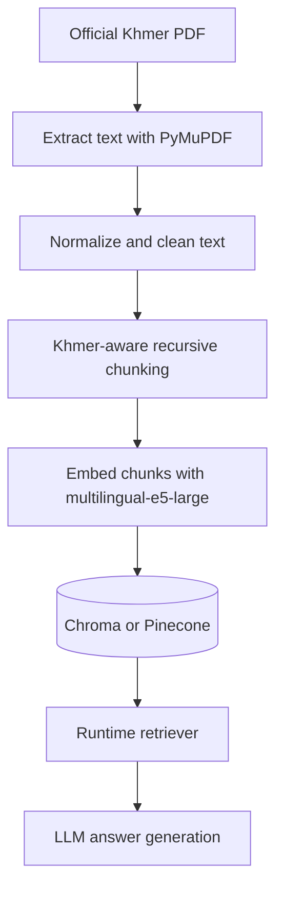

# RAG Ingestion and Embedding Workflow

This document explains how the TVET chatbot should ingest an official Khmer PDF, chunk it, embed it, and store it in the vector database.

The ingestion pipeline is intentionally separate from the user-facing backend API. Normal users should not upload source-of-truth documents. The organization updates the official document, then an admin runs the ingestion script.

## 1. Recommended Architecture



Runtime chat and admin ingestion are separate:

```text
Admin ingestion:
PDF -> extract -> clean -> chunk -> embed -> vector DB

Runtime chat:
question -> query embedding -> retrieve chunks -> prompt LLM -> answer
```

## 2. Files Added

```text
backend/
|-- services/
|   |-- embedding_service.py
|   `-- ingest_service.py
`-- scripts/
    `-- ingest_pdf.py
```

### `embedding_service.py`

Centralizes the embedding model configuration.

Current model:

```text
intfloat/multilingual-e5-large
```

The service supports E5 prefixes:

```text
passage: <document chunk>
query: <user question>
```

These prefixes improve E5 retrieval behavior. The prefixes are applied only during embedding. They are not stored inside the chunk text shown to the LLM.

### `ingest_service.py`

Handles:

- PDF text extraction
- Unicode normalization
- basic cleanup
- page-number removal
- Khmer-aware chunking
- metadata creation
- Chroma writing
- Pinecone writing

### `scripts/ingest_pdf.py`

Admin command for ingesting a new official PDF.

## 3. Chunking Strategy

The current splitter uses `RecursiveCharacterTextSplitter`.

Default settings:

```text
chunk_size: 1000 characters
chunk_overlap: 150 characters
```

Khmer-aware separators:

```python
[
    "\n\n",
    "\n",
    "។",
    "៕",
    "៖",
    ".",
    "?",
    "!",
    " ",
    "",
]
```

This tries to split by paragraph first, then line, then Khmer sentence punctuation, then smaller fallback boundaries.

## 4. Metadata Stored Per Chunk

Each chunk stores metadata like:

```json
{
  "source": "official_tvet_document.pdf",
  "source_path": "D:/path/to/official_tvet_document.pdf",
  "document_version": "2026",
  "page": 14,
  "start_index": 2300,
  "chunk_index": 32,
  "chunk_id": "official_tvet_document.pdf:2026:p14:c32:..."
}
```

This is important for debugging. If retrieval returns a bad answer, inspect the retrieved page and chunk metadata.

## 5. Environment Settings

The backend now supports these optional `.env` settings:

```env
VECTOR_STORE_PROVIDER=chroma
VECTOR_COLLECTION_NAME=tvet_programs_v2
PINECONE_NAMESPACE=tvet_programs_v2
EMBEDDING_USE_E5_PREFIXES=true
EMBEDDING_NORMALIZE=true
RETRIEVER_K=5
```

Use `VECTOR_STORE_PROVIDER=chroma` if your runtime retriever should read from Chroma.

Use `VECTOR_STORE_PROVIDER=pinecone` if your runtime retriever should read from Pinecone.

Important: ingestion and runtime retrieval must use the same embedding behavior. If you ingest with E5 prefixes enabled, runtime retrieval should also keep `EMBEDDING_USE_E5_PREFIXES=true`.

## 6. How To Run

Activate the backend virtual environment first.

PowerShell:

```powershell
cd backend
.\venv\Scripts\Activate.ps1
```

Or if your environment is already active:

```powershell
cd backend
```

## 7. Dry Run First

Always dry-run before writing vectors.

Example for Chroma:

```powershell
python scripts\ingest_pdf.py --pdf "D:\path\to\official_tvet.pdf" --store chroma --collection tvet_programs_v2 --version 2026 --dry-run
```

This will:

- extract text
- clean text
- split chunks
- print a few sample chunks
- not write to the vector database

If chunks look too small, increase `--chunk-size`.

If chunks lose context, increase `--chunk-overlap`.

## 8. Ingest Into Chroma

When the dry run looks good:

```powershell
python scripts\ingest_pdf.py --pdf "D:\path\to\official_tvet.pdf" --store chroma --collection tvet_programs_v2 --version 2026 --reset
```

`--reset` deletes the target Chroma collection before inserting the new chunks.

Use a new collection first, such as:

```text
tvet_programs_v2
```

Do not overwrite the old collection until you test retrieval quality.

## 9. Ingest Into Pinecone

If you want to ingest directly into Pinecone:

```powershell
python scripts\ingest_pdf.py --pdf "D:\path\to\official_tvet.pdf" --store pinecone --collection tvet_programs_v2 --namespace tvet_programs_v2 --version 2026 --reset
```

For Pinecone:

- `--namespace` controls where vectors are stored.
- If `--namespace` is omitted, the script uses the collection name as the namespace.
- `--reset` deletes all vectors in that namespace before inserting the new chunks.

## 10. Connect The Backend To The New Collection

After ingestion, update `.env`.

For Chroma:

```env
VECTOR_STORE_PROVIDER=chroma
VECTOR_COLLECTION_NAME=tvet_programs_v2
EMBEDDING_USE_E5_PREFIXES=true
EMBEDDING_NORMALIZE=true
RETRIEVER_K=5
```

For Pinecone:

```env
VECTOR_STORE_PROVIDER=pinecone
PINECONE_NAMESPACE=tvet_programs_v2
VECTOR_COLLECTION_NAME=tvet_programs_v2
EMBEDDING_USE_E5_PREFIXES=true
EMBEDDING_NORMALIZE=true
RETRIEVER_K=5
```

Then restart the backend server. The RAG chain is built when the backend starts, so config changes require a restart.

## 11. Recommended Evaluation Process

Before using the new document in production, prepare 15-30 test questions.

Use questions like:

```text
What programs are available in Phnom Penh?
តើមានកម្មវិធីបណ្តុះបណ្តាលអ្វីខ្លះ?
What are the admission requirements?
តើថ្លៃសិក្សាប៉ុន្មាន?
How long is the training?
Which institute offers electrical training?
```

For each question, check:

- Did the retriever return chunks from the correct page?
- Did the answer use only retrieved information?
- Did the assistant avoid inventing details?
- Did vague questions retrieve broad but relevant chunks?
- Did unsupported questions get a "not found in my data" style answer?

## 12. Tuning Guide

Start with:

```text
chunk_size=1000
chunk_overlap=150
retriever_k=5
```

If answers miss details:

```text
increase RETRIEVER_K to 8
```

If chunks are too fragmented:

```text
increase --chunk-size to 1200
increase --chunk-overlap to 200
```

If chunks contain too many unrelated topics:

```text
decrease --chunk-size to 700 or 800
```

If PDF extraction is poor:

```text
inspect dry-run chunks
try alternate PyMuPDF extraction modes or OCR if the PDF is scanned
use OCR only if the PDF is scanned/image-based
```

## 13. Important Rule

Do not mix embedding strategies in one collection.

If you change any of these, create a new collection or namespace and re-embed all documents:

- embedding model
- E5 prefix setting
- embedding normalization
- chunk size strategy
- source document version

This keeps retrieval behavior predictable and makes rollback easier.
